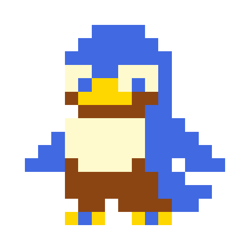
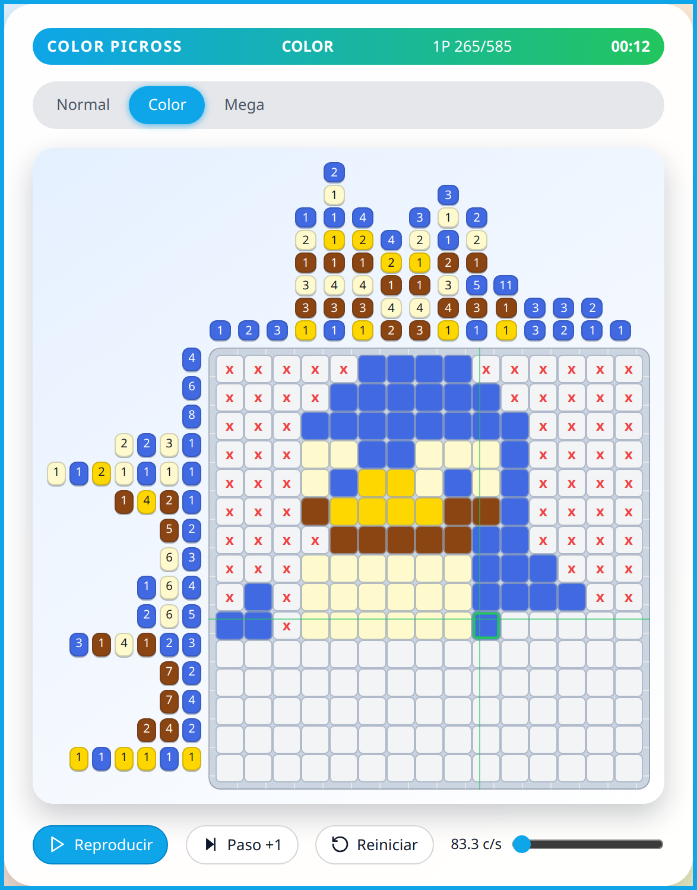

<a id="readme-top"></a>


<p align="center">
  &nbsp;
  &nbsp;
  &nbsp;
  &nbsp;
</p>

<br>

<div align="center">
  
  <h3 align="center">Picross Solver Frontend</h3>
  <p align="center">
    Frontend web (Next.js) para resolver Picross, Color Picross y Mega Picross con animación paso a paso.
    <br>
    <a href="https://github.com/hexed-AAL1X/Pickross"><strong>Explorar repositorio »</strong></a>
    <br><br>
    <a href="https://github.com/hexed-AAL1X/Pickross">Ver código</a>
    ·
    <a href="https://github.com/hexed-AAL1X/Pickross/issues/new?labels=bug">Reportar bug</a>
    ·
    <a href="https://github.com/hexed-AAL1X/Pickross/issues/new?labels=enhancement">Pedir feature</a>
  </p>
</div>

<details>
  <summary>Tabla de contenidos</summary>
  <ol>
    <li><a href="#about-the-project">About the project</a></li>
    <li><a href="#built-with">Built with</a></li>
    <li><a href="#important-notices">Important notices</a></li>
    <li>
      <a href="#getting-started">Getting started</a>
      <ul>
        <li><a href="#prerequisites">Prerequisites</a></li>
        <li><a href="#installation">Installation</a></li>
        <li><a href="#available-scripts">Available scripts</a></li>
      </ul>
    </li>
    <li>
      <a href="#contributing">Contributing</a>
      <ul>
        <li><a href="#top-contributors">Top contributors</a></li>
      </ul>
    </li>
    <li><a href="#contact">Contact</a></li>
  </ol>
</details>
<br>

<a id="about-the-project"></a>***About the project***


<p align="center" style="margin: 7px;">
  
</p>

PickCross es una aplicación web enfocada en resolver puzzles de **Picross** (Nonograma) y sus variaciones.

Incluye:

- Solver de Picross regular, Color Picross y Mega Picross.
- Visualización del tablero con animación paso a paso (play / pause / step / reset).
- Generación de patrones válidos y resolución por restricciones en el cliente.

<p align="right">(<a href="#readme-top">back to top</a>)</p>

<a id="built-with"></a>***Built with***


- 
- 
- 
- 

<p align="right">(<a href="#readme-top">back to top</a>)</p>

<a id="important-notices"></a>***Important notices***

> [!NOTE]
> El frontend vive en la carpeta `frontend/`.
>
> Usa `npm run dev` dentro de `frontend` para levantar el servidor local.

> [!IMPORTANT]
> La resolución del puzzle corre en el navegador. No necesitas backend para usar el solver.

<p align="right">(<a href="#readme-top">back to top</a>)</p>

<a id="getting-started"></a>***Getting started***

<a id="prerequisites"></a>

### Prerequisites

- Node.js (recomendado: LTS)
- npm

<a id="installation"></a>

### Installation

1) Clonar el repositorio

```bash
git clone https://github.com/hexed-AAL1X/Pickross.git
cd Pickross/frontend
```

2) Instalar dependencias

```bash
npm install
```

3) Ejecutar en modo desarrollo

```bash
npm run dev
```

4) Abrir en el navegador

- `http://localhost:3000/`

<a id="available-scripts"></a>

### Available scripts

```bash
npm run dev      # next dev
npm run build    # build producción
npm run start    # next start
npm run lint     # next lint
```

<p align="right">(<a href="#readme-top">back to top</a>)</p>

<a id="contributing"></a>***Contributing***

Contribuciones bienvenidas.

1) Fork del proyecto
2) Crear una rama (`git checkout -b feature/nueva-feature`)
3) Commit (`git commit -m "Add: ..."`)
4) Push (`git push origin feature/nueva-feature`)
5) Pull Request

<a id="top-contributors"></a>
### Top contributors

<div align="center">

<table>
  <tr>
    <td align="center" width="160">
      <a href="https://github.com/coshiiiiiiiiii">
        <br />
        <b>Ariana Quelopana Puppo</b><br />
        <sub>@coshiiiiiiiiii</sub>
      </a>
    </td>
    <td align="center" width="160">
      <a href="https://github.com/tsavorae">
        <br />
        <b>tera</b><br />
        <sub>@tsavorae</sub>
      </a>
    </td>
    <td align="center" width="160">
      <a href="https://github.com/LiamQuinoNeff">
        <br />
        <b>Liam Quino Neff</b><br />
        <sub>@LiamQuinoNeff</sub>
      </a>
    </td>
  </tr>
</table>

</div>

<p align="right">(<a href="#readme-top">back to top</a>)</p>

<a id="contact"></a>***Contact***

<p align="center">
  <a href="mailto:hexed_aal1x.ops@proton.me"></a>
  <a href="https://www.instagram.com/hexed_aal1x"></a>
  <a href="https://www.linkedin.com/in/leonardo-bravo-4120b8228/"></a>
</p>
<p align="right">(<a href="#readme-top">back to top</a>)</p>
